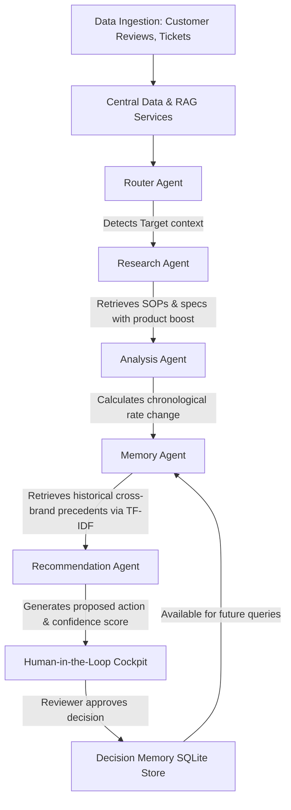

# Think9 Intelligence Hub - System Architecture

This document describes the multi-agent orchestration workflow and knowledge layers of the Think9 Intelligence Hub.

## System Architecture Diagram

## Core Components

### 1. Unified Knowledge Layer
* **SQLite Database Schema**: Captures `brands`, `products`, `consumer_feedback`, `documents` (SOPs/Specifications), and `decisions` (historical resolutions).
* **TF-IDF Vector Indexing**: Encodes text specifications and previous resolution descriptions to perform rapid cosine similarity matches across all brands.

### 2. Multi-Agent Sequential Workflow
* **Router Agent**: Resolves brand, product, and core problem topic.
* **Research Agent**: Queries customer reviews and matches related SOP documentation, applying a 1.2x similarity weight boost to product-specific matches.
* **Analysis Agent**: Evaluates complaint volume changes (Comparing last 30 days against the preceding 30 days) to diagnose trend gravity.
* **Memory Agent**: Performs a similarity search on historical resolved decisions to suggest cross-brand resolutions.
* **Recommendation Agent**: Combines research, trend analysis, and memory similarity scores to construct a proposed mitigation draft and confidence rating.

### 3. Human-In-The-Loop Approval Gate
* Ensures quality assurance managers retain oversight. 
* Prevents autonomous execution of supply-chain or product changes.
* Approved choices are archived in the decision database, immediately becoming searchable precedents.
